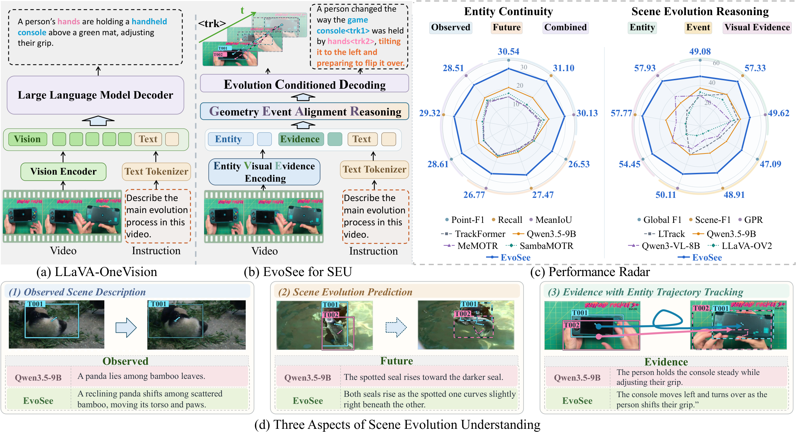
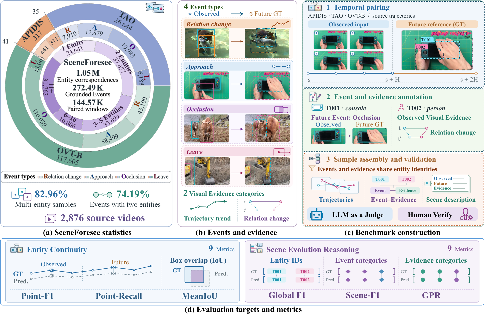
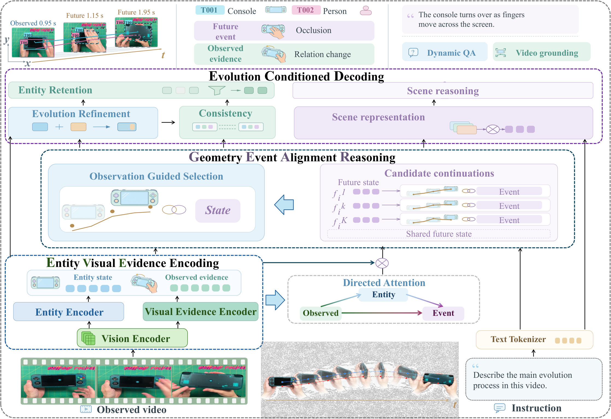
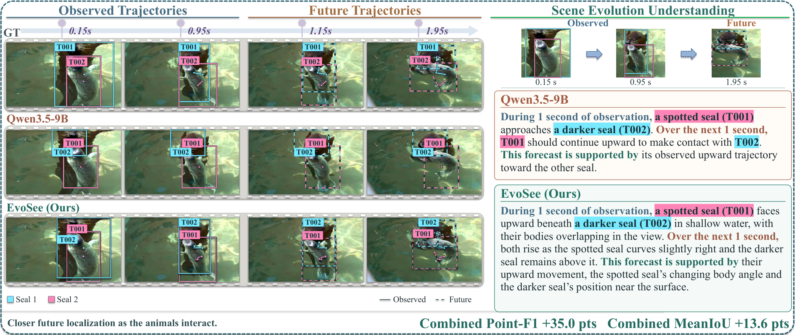

# SceneForesee: Learning Scene Evolution for Spatiotemporal Reasoning

**SceneForesee** evaluates entity continuity and scene evolution reasoning. **EvoSee** learns how observed entities develop and uses their predicted changes for spatiotemporal reasoning.

## Abstract

Large multimodal models (LMMs) need to understand how entities move and interact as a scene develops. This requires following the same entities over time and relating their observed motion to subsequent changes. We formulate Scene Evolution Understanding (SEU), a task for predicting and interpreting this change. Given observed video, a model estimates entity histories and predicts one scene continuation through future trajectories and Events, accompanied by Visual Evidence from observed motion and a scene description. We construct SceneForesee, a benchmark for evaluating entity continuity and scene evolution reasoning through paired observed and future scenes with shared entity identities. It contains 144.57K temporal pairs, 1.05M entity correspondences, and 272.49K Events paired with observed evidence. We propose a spatiotemporal reasoning framework, EvoSee, that learns future geometry and Event semantics through shared candidate states and joint assignment. It selects one continuation per entity from observation and uses the selected changes for entity refinement, retention, and scene representation. On SceneForesee, EvoSee outperforms Qwen3.5-9B by 10.45 points in Combined Point-F1 and 17.24 points in Event Global F1. On the 4D reasoning benchmark Dyn-Bench, it improves question answering accuracy and grounding J&F by 4.8 and 3.58 points over their respective base systems. These results support scene evolution as both a prediction target and a dynamic representation that brings predicted entity changes into spatiotemporal reasoning.

## Motivation

Dynamic video reasoning depends on understanding what changes while following the same entities through time. An entity retains its identity as its location, visibility, and relations develop. This continuity provides a reference for attributing future motion and interactions to the entities observed in the video.

A trajectory describes where an entity moves, while an Event summarizes how its state or relations develop. Both describe the same continuation. Learning them together under shared identities connects spatial prediction with semantic change. Observed Visual Evidence supplies the motion context for that continuation, and the predicted changes enrich the scene representation used for reasoning.

## Core Claims

- **Scene evolution connects continuity and change.** SEU evaluates future trajectories and Events with explicit participants, associated observed evidence, and scene descriptions under a common entity reference.
- **Geometry and Event semantics benefit from a shared continuation.** EvoSee predicts both through shared candidate states, uses geometric and Event errors jointly for candidate assignment during training, and selects one continuation from observation.
- **Predicted change informs entity and scene understanding.** The selected continuation refines entity estimates and supports entity retention. Scene representations combine observed and predicted context, improving dynamic question answering and grounding on Dyn-Bench.

## Figures

### Task

SEU estimates entity histories from observed video and predicts one scene continuation through future trajectories and Events. The output also identifies Visual Evidence in observation and describes the evolving scene.

### Benchmark

SceneForesee contains **144.57K temporal pairs**, **1.05M entity correspondences**, and **272.49K Events paired with observed evidence**. Its four Event categories are relation change, approach, occlusion, and leave. Visual Evidence describes individual trajectory trends or pairwise relation changes. Entity Continuity and Scene Evolution Reasoning evaluate complementary aspects of the same scenes.

### Method

EvoSee encodes observed entities and visual evidence, aligns future geometry with Event semantics, and selects one continuation per entity. The selected change contributes to entity refinement, retention, and scene representation.

### Qualitative Results

The qualitative comparison presents entity trajectories and scene descriptions at matched timestamps.

## Main Results

All scores below are percentages. SceneForesee comparisons share test samples, observation intervals, temporal extents, and metrics. Tracking adaptations are trained for SceneForesee. Qwen3.5-9B and EvoSee predict trajectories; the other language models use shared predictions from the TrackFormer-style task adaptation.

### Entity Continuity on SceneForesee

P-F1 and P-R denote Point-F1@0.5 and Point-Recall@0.5. Identity matching from observed trajectories remains fixed across observation and prediction. Combined scores weight observed and future scores by their annotated point counts.

| Method | Observed P-F1 | Observed P-R | Observed mIoU | Future P-F1 | Future P-R | Future mIoU | Combined P-F1 | Combined P-R | Combined mIoU |
| :--- | ---: | ---: | ---: | ---: | ---: | ---: | ---: | ---: | ---: |
| TrackFormer-style | 15.59 | 13.94 | 17.38 | 14.46 | 13.11 | 17.08 | 15.05 | 13.53 | 17.24 |
| MeMOTR-style | 15.62 | 13.71 | 16.55 | 15.00 | 13.44 | 16.43 | 15.35 | 13.60 | 16.50 |
| LTrack-style | 14.59 | 13.19 | 16.13 | 12.78 | 11.60 | 15.58 | 13.72 | 12.42 | 15.87 |
| SambaMOTR | 17.46 | 14.98 | 18.94 | 15.61 | 14.16 | 16.61 | 15.28 | 14.16 | 17.84 |
| Qwen3.5-9B | 20.55 | 19.72 | 21.58 | 15.49 | 14.78 | 17.55 | 18.16 | 17.35 | 19.65 |
| **EvoSee (Ours)** | **30.54** | **31.10** | **30.13** | **26.53** | **27.47** | **26.77** | **28.61** | **29.32** | **28.51** |

EvoSee leads all nine continuity metrics. Combined Point-F1 improves by **10.45 points** over Qwen3.5-9B, while Future Point-F1 improves by **10.92 points** over SambaMOTR, the strongest baseline in that metric. Gains in recall and overlap accompany more complete recovery of entity locations and more accurate spatial continuation.

### Scene Evolution Reasoning on SceneForesee

GF1 denotes Global F1, SF1 denotes Scene-F1, and GPR is the geometric mean of global precision and recall. Entity scores evaluate identities referenced in descriptions; Event and Visual Evidence scores evaluate category occurrences. GF1 and GPR pool matches across scenes, while SF1 weights scenes equally.

| Method | Entity GF1 | Entity SF1 | Entity GPR | Event GF1 | Event SF1 | Event GPR | Evidence GF1 | Evidence SF1 | Evidence GPR |
| :--- | ---: | ---: | ---: | ---: | ---: | ---: | ---: | ---: | ---: |
| TrackFormer-style | 29.59 | 40.42 | 37.18 | 19.56 | 16.97 | 28.33 | 12.17 | 10.59 | 17.63 |
| MeMOTR-style | 32.45 | 42.63 | 40.31 | 21.03 | 18.13 | 28.72 | 14.18 | 13.29 | 19.37 |
| LTrack-style | 30.18 | 41.06 | 37.60 | 22.30 | 20.32 | 29.87 | 15.03 | 14.04 | 20.12 |
| SambaMOTR | 33.91 | 42.25 | 43.02 | 21.87 | 20.06 | 28.10 | 16.46 | 13.46 | 21.93 |
| Qwen3.5-9B | 37.45 | 40.73 | 40.14 | 29.85 | 28.20 | 29.87 | 29.82 | 34.23 | 29.84 |
| Qwen3-VL-8B | 30.04 | 25.03 | 30.39 | 19.90 | 13.78 | 23.56 | 32.23 | 23.90 | 38.17 |
| InternVL3.5-8B | 32.92 | 30.53 | 33.92 | 15.86 | 12.56 | 17.20 | 30.13 | 27.32 | 32.66 |
| Qwen2.5-VL-7B | 40.46 | 51.21 | 43.24 | 11.67 | 12.05 | 11.93 | 27.48 | 34.29 | 28.10 |
| LLaVA-Video-7B | 35.84 | 38.11 | 36.16 | 10.16 | 8.49 | 10.67 | 20.43 | 22.10 | 21.47 |
| LLaVA-OneVision-1.5-8B | 33.69 | 34.81 | 34.63 | 12.79 | 9.58 | 13.42 | 24.11 | 21.04 | 25.30 |
| LLaVA-OneVision-2-8B | 33.54 | 34.14 | 33.75 | 9.21 | 7.86 | 9.81 | 15.90 | 14.79 | 16.94 |
| **EvoSee (Ours)** | **49.08** | **57.33** | **49.62** | **47.09** | **48.91** | **50.11** | **54.45** | **57.77** | **57.93** |

Global F1 improves by **8.62 points** for Entity, **17.24 points** for Event, and **22.22 points** for Visual Evidence over the strongest respective baselines. Scene-F1 gains also hold when scenes receive equal weight.

### Scene Evolution for 4D Reasoning on Dyn-Bench

EvoSee's scene representation augments Qwen3.5-9B for VQA and Sa2VA-InternVL2.5-8B for grounding. Observation-only Refinement retains the corresponding base system and uses observed summaries, isolating the contribution of predicted change. VQA Overall aggregates all questions; grounding Overall follows the mean J&F aggregation.

**Dynamic question answering accuracy**

| Method | Overall | Interaction | Object motion | Camera motion |
| :--- | ---: | ---: | ---: | ---: |
| Qwen3-VL-8B | 61.4 | 59.00 | 76.20 | 56.00 |
| DynTrace | 65.8 | 66.33 | 80.53 | 58.63 |
| Qwen3.5-9B | 63.5 | 59.20 | 79.35 | 58.87 |
| Observation-only Refinement | 66.7 | 67.40 | 80.62 | 60.83 |
| **EvoSee (Ours)** | **68.3** | **69.80** | **80.85** | **61.50** |

**Dynamic grounding J&F**

| Method | Overall | Interaction | Object motion | Camera motion |
| :--- | ---: | ---: | ---: | ---: |
| UniPixel-7B | 65.23 | 66.00 | 71.10 | 58.60 |
| Sa2VA-Qwen2.5-VL-7B | 72.80 | 73.40 | 75.90 | 69.10 |
| Sa2VA-InternVL2.5-8B | 75.70 | 76.80 | 80.20 | 70.10 |
| Observation-only Refinement | 77.02 | 77.12 | 80.21 | 73.73 |
| **EvoSee (Ours)** | **79.28** | **78.03** | **80.28** | **79.54** |

EvoSee improves VQA Overall by **4.8 points** over Qwen3.5-9B and grounding Overall by **3.58 points** over Sa2VA-InternVL2.5-8B. It also improves these scores by **1.6** and **2.26 points** over Observation-only Refinement. Predicted change contributes most to interactions and camera motion in these comparisons, connecting scene evolution learning with dynamic reasoning.
